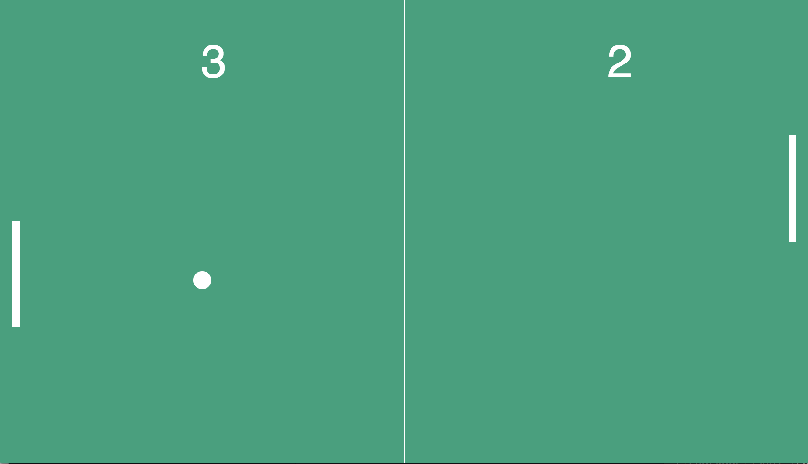

# pong
The classic pong game: one ball, two paddles and lots of vanilla javascript

- Left paddle is controlled with W (up) and S (down)
- Right paddle is controlled with &uarr; and &darr;
- The ball speed increases for each 10 points scored

 

